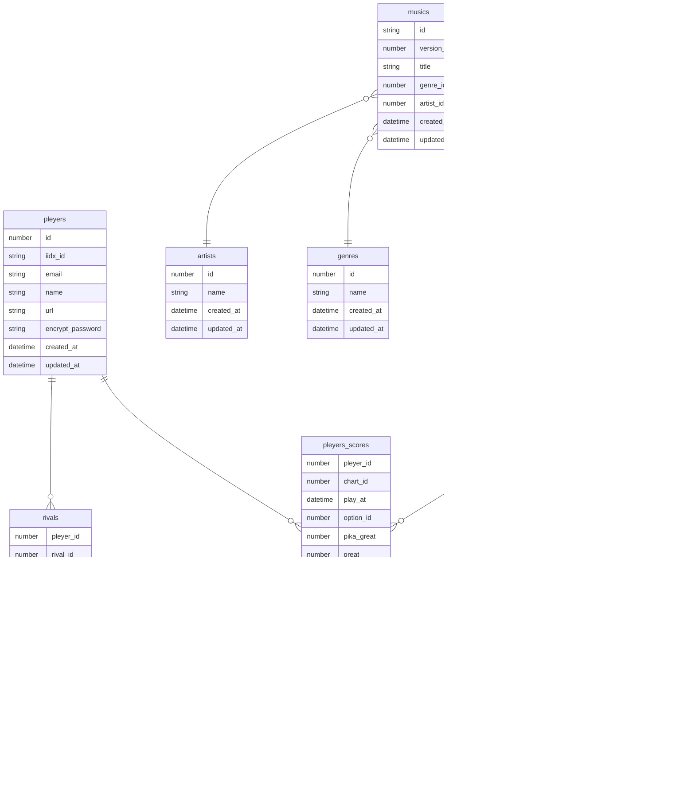

# ER図

```mermaid

erDiagram

pleyers ||--o{ pleyers_scores: ""
pleyers ||--o{ rivals: ""
pleyers_scores }o--|| options :""
pleyers_scores }o--|| clear_lamps:""
charts }o--|| difficulties:""
musics ||--|{ charts: ""
musics }o--|| versions: ""
musics }o--|| genres: ""
musics }o--|| artists: ""
charts ||--o{ pleyers_scores:""

pleyers {
    number id 
    string iidx_id
    string email
    string name
    string url
    string encrypt_password 
    datetime created_at
    datetime updated_at
}

rivals {
    number pleyer_id
    number rival_id
    datetime created_at
    datetime updated_at
}

pleyers_scores {
    number pleyer_id
    number chart_id
    datetime play_at
    number option_id
    number pika_great
    number great
    number bp
    number combo_break
    number clear_lamp
    string memo
    datetime created_at
    datetime updated_at
}

clear_lamps {
    number id
    string name
    datetime created_at
    datetime updated_at
}

options {
    number id
    string name
    datetime created_at
    datetime updated_at
}

musics {
    string id 
    number version_id
    string title
    number genre_id
    number artist_id
    datetime created_at
    datetime updated_at
}

genres {
    number id
    string name
    datetime created_at
    datetime updated_at
}

artists {
    number id
    string name
    datetime created_at
    datetime updated_at
}

versions {
    number id
    string name
    datetime created_at
    datetime updated_at
}

charts {
    number id
    string song_id
    number difficulty_id
    number level
    number bpm
    number notes_total
    number notes_scratch 
    number notes_charge
    number notes_backspin
    datetime created_at
    datetime updated_at
}

difficulties {
    number id
    string name
    datetime created_at
    datetime updated_at
}

```
