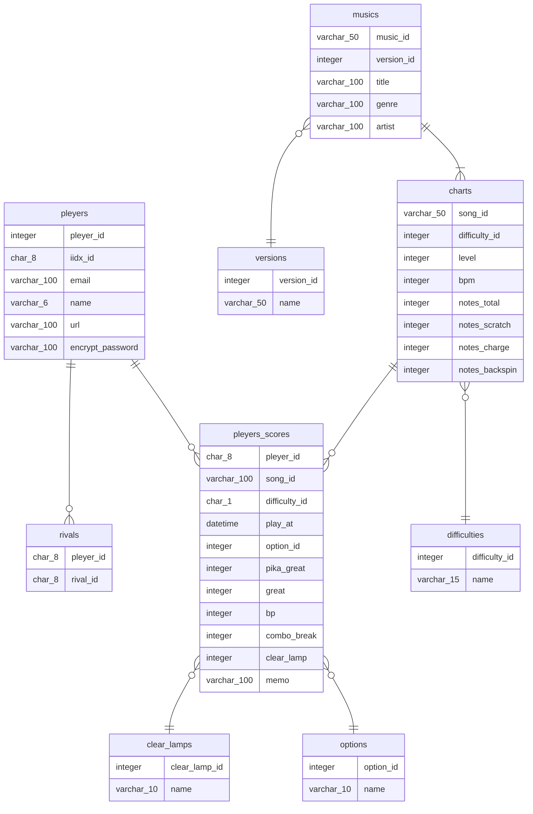

# ER図

```mermaid

erDiagram

pleyers ||--o{ pleyers_scores: ""
pleyers ||--o{ rivals: ""
pleyers_scores }o--|| options :""
pleyers_scores }o--|| clear_lamps:""
charts }o--|| difficulties:""
musics ||--|{ charts: ""
musics }o--|| versions: ""
charts ||--o{ pleyers_scores:""

pleyers{
    integer pleyer_id
    char_8 iidx_id
    varchar_100 email
    varchar_6 name
    varchar_100 url
    varchar_100 encrypt_password 
}

rivals {
    char_8 pleyer_id
    char_8 rival_id
}

pleyers_scores {
    char_8 pleyer_id
    varchar_100 song_id
    char_1 difficulty_id
    datetime play_at
    integer option_id
    integer pika_great
    integer great
    integer bp
    integer combo_break
    integer clear_lamp
    varchar_100 memo
}

clear_lamps {
    integer clear_lamp_id
    varchar_10 name
}

options {
    integer option_id
    varchar_10 name
}

musics {
    varchar_50 music_id 
    integer version_id
    varchar_100 title
    varchar_100 genre
    varchar_100 artist
}

versions {
    integer version_id
    varchar_50 name
}

charts {
    varchar_50 song_id
    integer difficulty_id
    integer level
    integer bpm
    integer notes_total
    integer notes_scratch 
    integer notes_charge
    integer notes_backspin
}

difficulties {
    integer difficulty_id 
    varchar_15 name
}

```
