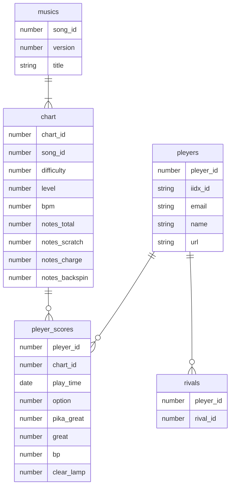

# ER図

```mermaid

erDiagram

musics ||--|{ chart: ""
pleyers ||--o{ pleyer_scores: ""
pleyers ||--o{ rivals: ""
chart ||--o{ pleyer_scores:""

pleyers{
    number pleyer_id
    string iidx_id
    string email
    string name
    string url
}

rivals{
    number pleyer_id
    number rival_id
}

pleyer_scores{
    number pleyer_id
    number chart_id
    date play_time
    number option
    number pika_great
    number great
    number bp
    number clear_lamp
}

musics{
    number song_id
    number version
    string title
}

chart{
    number chart_id
    number song_id
    number difficulty 
    number level
    number bpm
    number notes_total
    number notes_scratch 
    number notes_charge
    number notes_backspin
}

```
