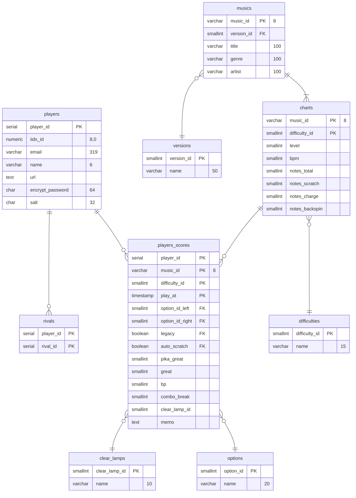

# ER図

```mermaid

erDiagram

players ||--o{ players_scores: ""
players ||--o{ rivals: ""
players_scores }o--|| options :""
players_scores }o--|| clear_lamps:""
charts }o--|| difficulties:""
musics ||--|{ charts: ""
musics }o--|| versions: ""
charts ||--o{ players_scores:""

players{
    serial player_id PK
    numeric iidx_id "8,0"
    varchar email "319"
    varchar name "6"
    text url
    char encrypt_password "64"
    char salt "32"
}

rivals {
    serial player_id PK
    serial rival_id PK
}

players_scores {
    serial player_id PK
    varchar music_id PK "8"
    smallint difficulty_id PK
    timestamp play_at PK
    smallint option_id_left FK
    smallint option_id_right FK
    boolean legacy FK
    boolean auto_scratch FK
    smallint pika_great
    smallint great
    smallint bp
    smallint combo_break
    smallint clear_lamp_id
    text memo
}

clear_lamps {
    smallint clear_lamp_id PK
    varchar name "10"
}

options {
    smallint option_id PK
    varchar name "20"
}

musics {
    varchar music_id PK "8"
    smallint version_id FK
    varchar title "100"
    varchar genre "100"
    varchar artist "100"
}

versions {
    smallint version_id PK
    varchar name "50"
}

charts {
    varchar music_id PK "8"
    smallint difficulty_id PK
    smallint level
    smallint bpm
    smallint notes_total
    smallint notes_scratch
    smallint notes_charge
    smallint notes_backspin
}

difficulties {
    smallint difficulty_id PK
    varchar name "15"
}

```
